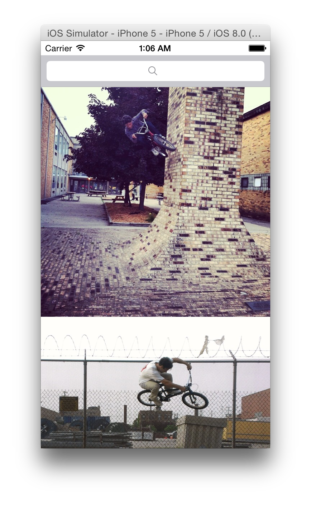
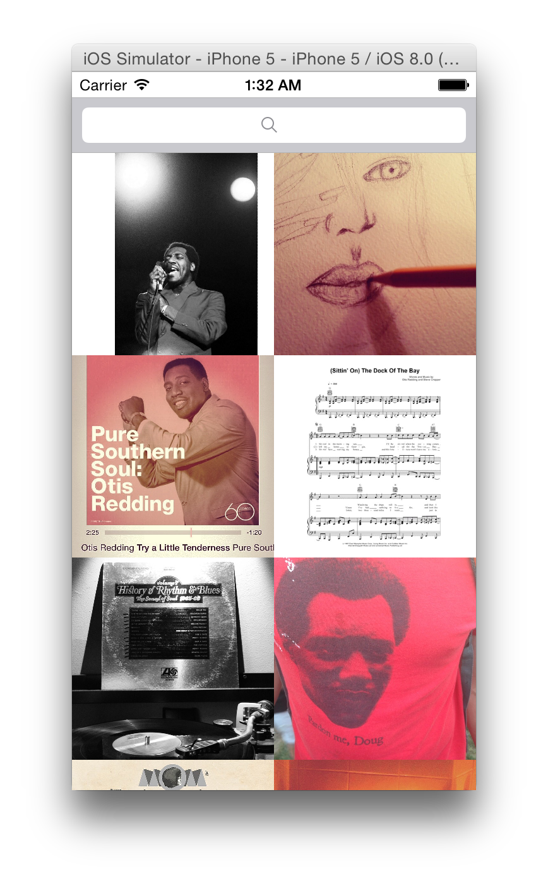

# Instagram Search by Hashtag

Photo search example written in Swift for iOS 8.

There are currently two iOS projects in this repo. One uses UITableView and the other uses UICollectionView.

# Notes

This project is part of Thinkful's course [Intro to iOS Programming in Swift](http://thinkful.com)